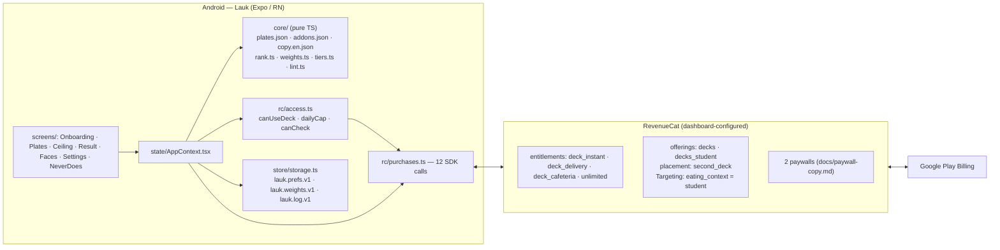

# Architecture

Derived from the code as it is (2026-09-16). Modules named here exist; calls named here are greppable.

## Stack (from `package.json` files)

| Layer                    | Package                                                            | Version                  |
| ------------------------ | ------------------------------------------------------------------ | ------------------------ |
| App                      | `expo` / `react-native` / `react`                                  | ~53.0 / 0.79.6 / 19.0    |
| Purchases                | `react-native-purchases` · `react-native-purchases-ui`             | ^10.9 (10.9.1 installed) |
| Ring                     | `react-native-svg` + React Native `Animated`                       | 15.11                    |
| Haptics · fonts · locale | `expo-haptics` · `@expo-google-fonts/nunito` · `expo-localization` | Expo-managed             |
| Storage                  | `@react-native-async-storage/async-storage` (versioned JSON keys)  | 2.1                      |
| Tests / scripts          | `vitest` · `tsx`                                                   | 4.x · 4.x                |
| Backend                  | none                                                               | —                        |

Two `package.json` files: the root (tests, scripts, lint) and `app/` (the Expo project). The root imports
`app/src/core` downward; the app imports nothing above itself, so Metro needs no `watchFolders` trick.

## System



## The flow (App.tsx is one switch)

```
onboarding ─▶ plates ─(tile tap)─▶ ceiling sheet ─▶ result (ring + 3 cards) ─(tap card)─▶ cue ─▶ faces ─▶ plates
                 │                                                                  ▲
                 ├─ locked tile ──▶ presentPaywall(offering from placement) ───────┘ (unlock → same tap continues)
                 ├─ cap reached ──▶ presentPaywallIfNeeded('unlimited') ───────────┘
                 └─ ⚙ ──▶ settings (decks shelf · restore · customer center · weights · never-does · about)
```

## Modules

| Path                                    | Responsibility                                                                                                                                                                                                                                                          |
| --------------------------------------- | ----------------------------------------------------------------------------------------------------------------------------------------------------------------------------------------------------------------------------------------------------------------------- |
| `app/src/core/pillars.ts`               | types: `Pillar`, `Levels`, `Plate`, `Add`, `Tier`, `Weights`; `isAvailable`, `levelsAfter`                                                                                                                                                                              |
| `app/src/core/rank.ts`                  | `rankAdds(plate, ceiling, adds, weights) → Card[]`; `tiersFor`; `litCount` — see `docs/RANKER.md`                                                                                                                                                                       |
| `app/src/core/weights.ts`               | `applyFace(weights, add, face)` — η 0.15, clamp [0.5, 1.5]                                                                                                                                                                                                              |
| `app/src/core/tiers.ts`                 | ceiling labels per currency, `costLabel`, region → currency                                                                                                                                                                                                             |
| `app/src/core/lint.ts`                  | `BANNED` (22 tokens), `findBannedWords`, `stringLeaves`                                                                                                                                                                                                                 |
| `app/src/core/content/`                 | generated by `scripts/seed.ts`; `CONTENT_HASH` = sha256 of the three JSON files                                                                                                                                                                                         |
| `app/src/rc/purchases.ts`               | configure · setAttributes · syncAttributesAndOfferingsIfNeeded · getOfferings · getCurrentOfferingForPlacement · purchasePackage · getCustomerInfo · addCustomerInfoUpdateListener · restorePurchases · presentPaywall · presentPaywallIfNeeded · presentCustomerCenter |
| `app/src/rc/access.ts`                  | entitlement math over `CustomerInfo.entitlements.active` (pure, tested)                                                                                                                                                                                                 |
| `app/src/store/storage.ts` · `dates.ts` | AsyncStorage read/write with validation + fallbacks; `today`, `checksToday`, `weekStrip` (pure, tested)                                                                                                                                                                 |
| `app/src/state/AppContext.tsx`          | prefs, weights, log, live `CustomerInfo` (via the SDK listener), current offering                                                                                                                                                                                       |
| `app/src/components/`                   | `PillarRing` (SVG, 5 × 72° arcs, animated amber fill) · `AddCard` · `PlateTile` · `FaceRow` · `WeekStrip` · `CueBar` · `Press` (44 px hit target, pressed state) · `T`                                                                                                  |
| `scripts/seed.ts`                       | the content tables → JSON + hash; exits non-zero on a bad id/pillar/deck                                                                                                                                                                                                |
| `scripts/check.ts`                      | the no-credential CLI                                                                                                                                                                                                                                                   |
| `scripts/bench.ts`                      | p50/p95 + the three asserted queries + I1/I2 + hash; exits non-zero on failure                                                                                                                                                                                          |
| `scripts/check-submission-readiness.ts` | placeholders, kill-switch flags, banned words in prose, intention-as-fact, creator-name scan, store essentials                                                                                                                                                          |
| `app/plugins/withReleaseSigning.js`     | config plugin: release signing from `LAUK_KEYSTORE_*` env (keystore in `~/.config/lauk/`, never in the tree)                                                                                                                                                            |

## Data (AsyncStorage)

| Key               | Shape                                                                              |
| ----------------- | ---------------------------------------------------------------------------------- |
| `lauk.prefs.v1`   | `{ eating_context: 'student' \| 'office' \| 'road' \| null, currency, onboarded }` |
| `lauk.weights.v1` | `{ filling, fresh, rich, bright, crunch }` each in [0.5, 1.5]                      |
| `lauk.log.v1`     | `Array<{ day, ts, plate, ceiling, add \| null, face \| null }>`, last 60 rows      |

No entitlement, balance or purchase state is stored locally — `getCustomerInfo()` is the only source of truth,
which is why step 8 of the judge path (force-stop, cold start, deck still open) proves something.

## Entitlement math

| Entitlements active | Decks open          | Checks / day |
| ------------------- | ------------------- | ------------ |
| none                | Counter             | 1            |
| any `deck_*`        | Counter + that deck | 3            |
| `unlimited`         | all                 | ∞            |

`tests/access.test.ts` walks all 16 subsets.

## Honest limits

- Targeting by custom attribute depends on the attribute reaching RevenueCat before offerings are fetched; the app
  calls `syncAttributesAndOfferingsIfNeeded()` right after `setAttributes` and re-reads the placement on every locked-tile
  tap. Verified against the typings; device verification is still pending (as of 2026-09-23).
- Paywall strings live in the dashboard. They are authored and lint-checked in `docs/paywall-copy.md` first; the
  paywall on the `decks` offering was published 2026-09-16; on-device screenshots are still pending.
- Test Store purchases show no Play dialog. The published build uses the Google Play key (`EXPO_PUBLIC_RC_STORE=GOOGLE`).
