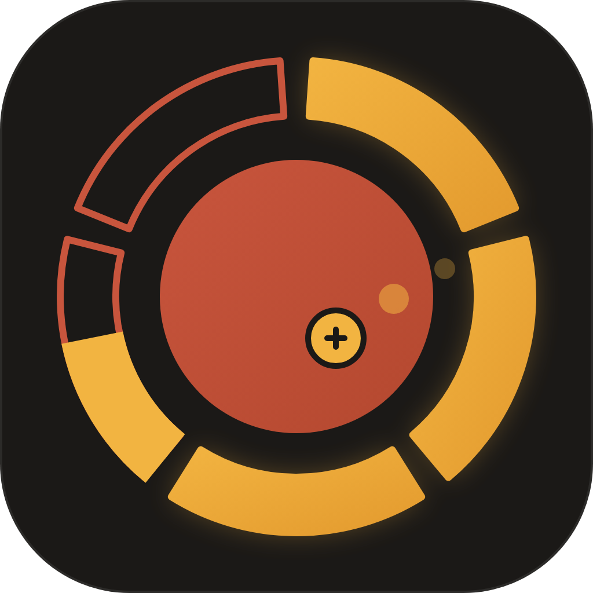

<div align="center">



# Lauk

**Tap the plate you already bought. One cheap add makes it satisfying.**



[](https://lauk.edycu.dev/)  [](https://revenuecat-shipaton-2026.devpost.com/)

[For the judge → JUDGE.md](JUDGE.md) · [The demo query](#-the-ten-second-flow) · [Run the tests](#-run-it-without-credentials) · [RevenueCat integration](#-revenuecat-is-the-engine)

      [](https://github.com/edycutjong/lauk/actions/workflows/ci.yml) [](https://github.com/edycutjong/lauk/actions/workflows/codeql.yml) [](https://github.com/edycutjong/lauk/actions/workflows/gitleaks.yml) [](https://github.com/edycutjong/lauk/releases)

</div>

---

## 🍚 What it is

People who buy every meal — boarding-house students, junior office staff, delivery riders — don't lack nutrition information. They lack a decision they can act on **at the table, with the money they actually have**. Every app answers a counting question or a cooking question; nobody answers _"I already bought this — what is the one cheap thing that would make it satisfying?"_

Lauk is a plate check that takes ten seconds. Tap the meal in front of you (12 universal plates, four decks), tap a spend ceiling (Free / Small / Medium / Treat, in your currency), and Lauk maps the plate onto **five satisfaction pillars — filling · fresh · rich · bright · crunch** — and returns **three one-add upgrades, cheapest first**, from a hand-authored table of 40 adds you can actually get at that kind of counter. Tap one: the ring fills, a haptic lands, one line fades in — _Eat until satisfied, not until empty._

No food database. No camera. No AI. No backend. No account. No streaks, no red days, and none of the 22 words listed on the "What Lauk never does" screen — a test fails if one ever appears in the copy.

> Built for the Shipaton 2026 **Influencer Award — Nutrition & Healthy Eating** brief: _"a flexible nutrition app that helps people make meals more satisfying without calorie counting, macro tracking, or restrictive meal plans."_

## ⚡ The ten-second flow

```
$ npm run check -- rice_side 2

Rice plate + one side (nasi + 1 lauk) · Medium ≤ Rp 5k
plate  filling ●  fresh ○  rich ◐  bright ○  crunch ○   2 of 5 lit

1. Lime wedge (jeruk nipis) — Free → lifts bright
   after  filling ●  fresh ○  rich ◐  bright ◐  crunch ○   3 of 5 lit
2. Raw veg + chili (lalapan + sambal) — Rp 2.000 → lifts fresh + bright
   after  filling ●  fresh ◐  rich ◐  bright ◐  crunch ○   4 of 5 lit
3. Fried egg (telur dadar / ceplok) — Rp 5.000 → lifts rich
   after  filling ●  fresh ○  rich ●  bright ○  crunch ○   2 of 5 lit

Eat until satisfied, not until empty.
```

That is the whole product: the plate you already have goes from 2 of 5 to 4 of 5 for Rp 2,000, and no number is ever shown to the user. The terminal prints exactly what the app renders — the ranker is one pure function (`app/src/core/rank.ts`, [docs/RANKER.md](docs/RANKER.md)), deterministic across 1,000 runs, p95 in single-digit microseconds (`npm run bench`).

In the app: **Plates → Ceiling → Ring + 3 cards → tap → cue → three faces → week strip.** The faces are the only tracking — they nudge five pillar weightings (shown as bars in Settings, resettable) so tomorrow's cards lean toward what actually satisfied you.

## 💳 RevenueCat is the engine

Remove RevenueCat and every deck but Counter is permanently locked, the second check of the day dead-ends, the Semester pass never appears, and Restore / Manage vanish — the app collapses to a one-deck, one-check toy. Twelve SDK calls, all in [`app/src/rc/purchases.ts`](app/src/rc/purchases.ts):

| Where in the flow                       | Call                                                                                                                            | Why                                                                                                                                                                    |
| --------------------------------------- | ------------------------------------------------------------------------------------------------------------------------------- | ---------------------------------------------------------------------------------------------------------------------------------------------------------------------- |
| Launch                                  | `Purchases.configure`                                                                                                           | anonymous customer, no login                                                                                                                                           |
| Onboarding ("Where do you mostly eat?") | `setAttributes({ eating_context })` → `syncAttributesAndOfferingsIfNeeded()`                                                    | a dashboard **Targeting rule** serves the `decks_student` offering (Semester pass first) at placement `second_deck`                                                    |
| Plates screen                           | `getOfferings()`                                                                                                                | live price badge on every locked tile                                                                                                                                  |
| Locked tile tap                         | `getCurrentOfferingForPlacement('second_deck')` → `RevenueCatUI.presentPaywall({ offering, customVariables: { deck, plate } })` | the paywall headline names the plate you tapped                                                                                                                        |
| Second check of the day (free tier)     | `RevenueCatUI.presentPaywallIfNeeded({ requiredEntitlementIdentifier: 'unlimited' })`                                           | shows nothing if you already have Unlimited                                                                                                                            |
| Every tile, every check                 | `getCustomerInfo()` + `addCustomerInfoUpdateListener`                                                                           | `entitlements.active` decides the gate — `canUseDeck` / `dailyCap` in [`app/src/rc/access.ts`](app/src/rc/access.ts), unit-tested over all 16 entitlement combinations |
| Decks shelf                             | `purchasePackage(pkg)`                                                                                                          | one-time deck unlocks + Unlimited monthly (7-day trial) / Semester pass                                                                                                |
| Settings                                | `restorePurchases()` · `RevenueCatUI.presentCustomerCenter()`                                                                   | reinstall, device swap, cancel                                                                                                                                         |

**Tiers:** Free = Counter deck, 1 check/day · any deck (one-time) = that deck + 3 checks/day · **Unlimited** (monthly, 7-day free trial — the judge path) = every deck, no cap.

## 🧪 Run it without credentials

```bash
npm install --legacy-peer-deps
npm test                      # 76 tests: ranker, content invariants, copy-lint, weights, tiers, entitlement math
npm run check -- rice_side 2  # the demo query, in your terminal
npm run check -- --list       # every plate id
npm run bench                 # p50/p95 over 12 plates × 4 ceilings × 3 weighting profiles + invariants + content hash
```

No device, no key, no network. The whole core (`app/src/core/`) is pure TypeScript with zero React Native imports; the app, the CLI and the bench import the same modules.

### Run the app (dev build, Android)

```bash
cd app && npm install --legacy-peer-deps
cp ../.env.example .env        # paste your RevenueCat Test Store public key
npx expo prebuild --platform android
npx expo run:android           # physical device or emulator; RevenueCat needs a dev build, not Expo Go
```

The RevenueCat project needs: entitlements `deck_instant`, `deck_delivery`, `deck_cafeteria`, `unlimited`; products named after them; offerings `decks` (default) and `decks_student`; placement `second_deck` with the Targeting rule `eating_context is student → decks_student`; two paywalls whose copy is in [docs/paywall-copy.md](docs/paywall-copy.md) (lint-checked before pasting). Without a key the app still runs — every deck but Counter stays locked and the shelf says so.

## 🔍 Tests as the spec

| Invariant                                                                                                                                       | Test                                              |
| ----------------------------------------------------------------------------------------------------------------------------------------------- | ------------------------------------------------- |
| **150,000 (plate, ceiling, weighting) queries** — every card affordable, useful, distinct, cheapest-first; 0 violations                         | `tests/exhaustive.test.ts`                        |
| Every (plate, ceiling) pair returns ≥ 1 card; every add lifts a hollow pillar on ≥ 1 plate it is available for                                  | `tests/content.test.ts`                           |
| The three reference queries return exactly their triples; the ranker is deterministic over 1,000 runs                                           | `tests/rank.test.ts`                              |
| **No banned word in any content string, UI string, or the dashboard paywall copy** — the compassionate-flexibility criterion, machine-checked   | `tests/lint.test.ts`                              |
| Faces move pillar weightings by η = 0.15 and never leave [0.5, 1.5]                                                                             | `tests/weights.test.ts`                           |
| `canUseDeck` / `dailyCap` over all 16 entitlement subsets; expired entitlements, purchase records, sibling decks and look-alike ids stay locked | `tests/access.test.ts` · `tests/boundary.test.ts` |
| 6 regression tests, each named after the defect it pins (e.g. `tiersFor_treat_ceiling_kept_tier_3_after_truncating_before_filtering`)           | `tests/regressions.test.ts`                       |
| `CONTENT_HASH` equals sha256 of the JSON on disk; `npm run seed` is reproducible                                                                | `tests/content.test.ts` · CI Stage 1              |

## 🛠️ Engineering harness

**Pipeline:** Quality → Security → Metro bundle → Android native build → Bench → Deploy gate (`.github/workflows/ci.yml`)

```bash
npm run ci             # prettier · eslint · tsc ×2 · vitest + coverage · bench · readiness
npm run bundle:check   # expo export + assert the RC calls and the content are in the Hermes bundle
npm run test:coverage  # 100 % lines over the pure core
npm run audit          # npm audit, root + app
npm run secrets        # gitleaks over the tree (CI runs it over full history)
```

| Layer                                       | Tool                                                                                   | Status                         |
| ------------------------------------------- | -------------------------------------------------------------------------------------- | ------------------------------ |
| Code quality                                | Prettier · ESLint 9 (flat) · tsc against both tsconfigs                                | ✅                             |
| Unit tests                                  | vitest — 76 tests, 100 % lines on `core/` + `rc/access.ts`                             | ✅                             |
| High-signal tests                           | 150,000-case exhaustive · 6 defect-named regressions · entitlement boundary            | ✅                             |
| Build verification                          | Metro export + bundle assertions; Android `assembleDebug` + manifest inspection (main) | ✅                             |
| Security (SAST / SCA)                       | CodeQL · Dependabot (root, app, actions; grouped, no majors) · npm audit               | ✅                             |
| Secret scanning                             | gitleaks (full history) · TruffleHog (verified)                                        | ✅                             |
| Performance                                 | ranker bench, p95 budget 1 ms, fails on content-hash drift                             | ✅                             |
| Release                                     | semantic version from Angular commits (`release.yml`)                                  | ✅                             |
| Community                                   | CoC · Contributing · Security policy · issue & PR templates · MIT                      | ✅                             |
| **Device run · real purchase · stall test** | —                                                                                      | ⏳ pending, dated in `DEMO.md` |

## 📦 Repository

```
app/src/core/      pillars · rank · weights · tiers · lint · content/ (generated by scripts/seed.ts)
app/src/rc/        purchases.ts (the 12 SDK calls) · access.ts (entitlement math)
app/src/store/     AsyncStorage: prefs · weights · log (last 60 rows)
app/src/screens/   Onboarding · Plates · Ceiling · Result (ring + cards + cue) · Faces · Settings · NeverDoes
scripts/           seed · check (CLI) · bench · check-submission-readiness
tests/             76 tests, vitest, < 1 s (incl. 150,000-query exhaustive verification)
docs/              RANKER.md · paywall-copy.md · assets/
site/              landing page + privacy policy (GitHub Pages, .github/workflows/pages.yml)
```

See [ARCHITECTURE.md](ARCHITECTURE.md) (regenerated from the code) and [DEMO.md](DEMO.md) (judge path, receipts, what is still unfinished).

## 📄 License

MIT — see [LICENSE](LICENSE).
